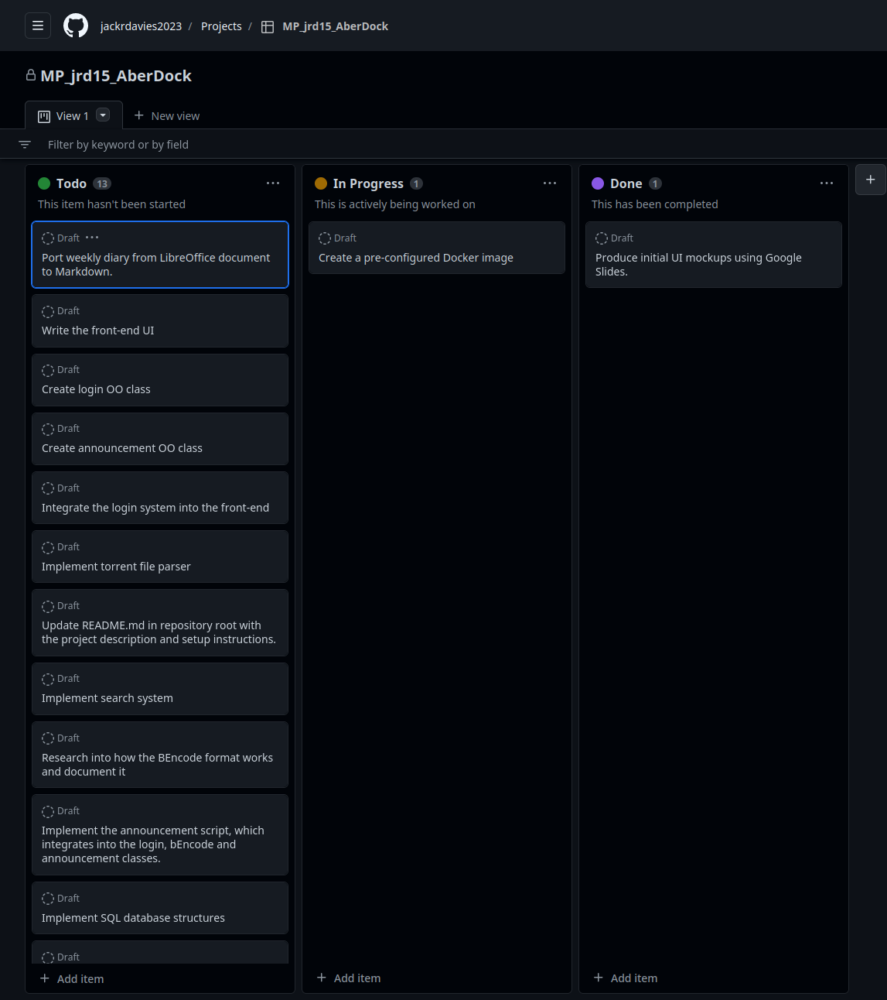
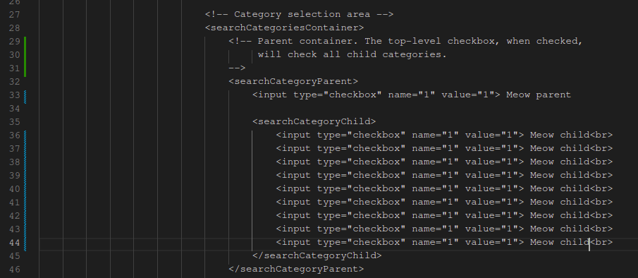

# Major Project Diary (jrd15) #
This document is a record of my progress as I develop my project and serve as a reference point when undertaking my report.

## February 13, 2023 ##
Initial creation of the Git repository, hosted on [Github](https://github.com/jackrdavies2023/jrd15_MP_AberDock_BitTorrent)

## February 15, 2023 ##
Pushed initial project outline to the Git repository. [Link](https://github.com/jackrdavies2023/jrd15_MP_AberDock_BitTorrent/commit/96288dff7e6707e2a2f91e2731a91a153dc8a4bd)

## February 20, 2023 ##
Completed and pushed initial UI design mockups to the Git repository. Mockups were made using Google Slides. [Link](https://github.com/jackrdavies2023/jrd15_MP_AberDock_BitTorrent/commit/b350b1b129776bb710a0b39b03f90959370659eb)

## February 22, 2023 ##
Created another Git repository, which will host the main code and Docker configuration. This repository was added as a submodule to the main repository. [Link](https://github.com/jackrdavies2023/jrd15_MP_AberDock_BitTorrent_src)

## February 22, 2023 ##
Initial creation of docker-compose and Dockerfile. The docker-compsose defines how an image is set up, and the Dockerfile builds the image that will be used by the docker-compose.

Sources used to understand docker-compose:

* https://docs.docker.com/compose/compose-file/build/ 
* https://docs.docker.com/compose/compose-file/

Sources used to start NGINX from within a docker container that is built on top of Debian:

* https://stackoverflow.com/questions/24241292/dockerized-nginx-is-not-starting
* https://stackoverflow.com/questions/45371521/adding-startup-script-to-dockerfile

The above screenshot shows tests being performed against the NGINX container, to ensure that it is responding to requests.

I then proceeded to modifying the docker image entrypoint script to start PHP-FPM. Sources used:

* https://stackoverflow.com/questions/37313780/how-can-i-start-php-fpm-in-a-docker-container-by-default

 funciton being called, to show the PHP configuration within the client browser.")

The Dockerfile was updated to include a customised nginx configuration, which enables PHP support. A index.php was placed in /var/www/html, which contains the function call “phpinfo()”, to test that PHP is working correctly.

## Februrary 23, 2023 ##
Created a project on Github, to keep track of task progress.

I also refactored the file structure for the Docker files, so that the Dockerfile can include the “www” directory that was previously in the parent directory.

## February 25, 2023 ##
Implemented back-end navigation code to load a different page based on the GET parameter in the URL. Pages are stored and loaded as templates, using the [Smarty template library](https://www.smarty.net/).

## March 1, 2023 ##
Implemented the side navigation bar, featuring navigation links and the user profile image and name, as well as a custom "logo" at the top.

The navigation bar is stored in its own template file, called "navbar.tpl". This file is included by other template files, such as "browse.tpl", "upload.tpl" and "statistics.tpl".

Note the line

    {include file='navbar.tpl'}

The logo was created using GIMP. I took a photo from the top of Constitution Hill, Aberystwyth, and drew a simple boat and two letters, "A" and "D, for "Aber Dock".

## March 2, 2023 ##
I started working on the browse page, which is the main part of the site that is used for searching and browsing for content.

"Cards" were created to list each torrent and to seperate content.

Each card consists of a custom DOM named "card". The "card" element is styled using CSS, and using a custom element rather than a DIV improves code readability.

### HTML ###

### CSS ###

The background colour of the card is defined by a global variable, which is defined at the beginning of the stylesheet. This variable will differ based on the users browser preferences. If the browser reports that the operating system uses the dark colour scheme, the dark theme will be used. Otherwise the light colour scheme will be defaulted to.

The icons used in torrent cards, are SVG files obtained from [Google fonts](https://fonts.google.com/icons)

The advantage to using SVG files rather than PNG or JPEG is that they are vector images, meaning that they are typically smaller in size, scale without loss of quality and they can be colourised using CSS, meaning I don't need a new icon for each colour scheme.

The icons are defined using the below CSS:

The "background-color" option is defined by a global variable, which is set based on the users global system theme.

## March 2, 2023 ##
The initial UI for the search engine has been written. This consists of a search box, followed by check boxes for filtering out search results to give the user accurate results.

The search box has been styled to have rounded edges, and the browsers default border/highlight for text boxes has been overwritten with CSS to give it a modern appearance.

Categories are ordered by parents and children. Parent categories will consist of children categories which relate to the parent. For example, there will be a parent category called "Photos", and the children categories will consist of the types of photo, such as "Aberystwyth", "Artwork", "Pets" and so forth. In the above screenshot, there are placeholders which were used during the development process.

## March 2, 2023 ##
I added the template files for the pages "statistics" and "upload". For each page there are two files, the "PHP" files for setting Smarty environment variables and performing any additional checks that will come in the future; and the "TPL" files which are Smarty templates, which will contain the HTML front-end markup that the client will see. These pages can be navigated to using the side navigation menu.

These changes are reflected in [this commit](https://github.com/jackrdavies2023/jrd15_MP_AberDock_BitTorrent_src/commit/53af199136d8b1dc4466ff211bc834973cd17b7d).

