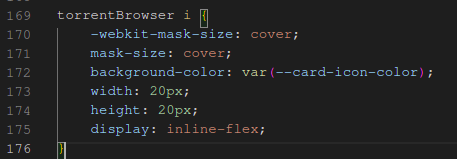

# Major Project Diary (jrd15) #
This document is a record of my progress as I develop my project and serve as a reference point when undertaking my report.

## February 13, 2023 ##
Initial creation of the Git repository, hosted on [Github](https://github.com/jackrdavies2023/jrd15_MP_AberDock_BitTorrent)

## February 15, 2023 ##
Pushed initial project outline to the Git repository. [Link](https://github.com/jackrdavies2023/jrd15_MP_AberDock_BitTorrent/commit/96288dff7e6707e2a2f91e2731a91a153dc8a4bd)

## February 20, 2023 ##
Completed and pushed initial UI design mockups to the Git repository. Mockups were made using Google Slides. [Link](https://github.com/jackrdavies2023/jrd15_MP_AberDock_BitTorrent/commit/b350b1b129776bb710a0b39b03f90959370659eb)

## February 22, 2023 ##
Created another Git repository, which will host the main code and Docker configuration. This repository was added as a submodule to the main repository. [Link](https://github.com/jackrdavies2023/jrd15_MP_AberDock_BitTorrent_src)

## February 22, 2023 ##
Initial creation of docker-compose and Dockerfile. The docker-compose defines how an image is set up, and the Dockerfile builds the image that will be used by the docker-compose.

Sources used to understand docker-compose:

* https://docs.docker.com/compose/compose-file/build/ 
* https://docs.docker.com/compose/compose-file/

Sources used to start NGINX from within a docker container that is built on top of Debian:

* https://stackoverflow.com/questions/24241292/dockerized-nginx-is-not-starting
* https://stackoverflow.com/questions/45371521/adding-startup-script-to-dockerfile

The above screenshot shows tests being performed against the NGINX container, to ensure that it is responding to requests.

I then proceeded to modifying the docker image entrypoint script to start PHP-FPM. Sources used:

* https://stackoverflow.com/questions/37313780/how-can-i-start-php-fpm-in-a-docker-container-by-default

 funciton being called, to show the PHP configuration within the client browser.")

The Dockerfile was updated to include a customised nginx configuration, which enables PHP support. A index.php was placed in /var/www/html, which contains the function call “phpinfo()”, to test that PHP is working correctly.

## Februrary 23, 2023 ##
Created a project on Github, to keep track of task progress.

I also refactored the file structure for the Docker files, so that the Dockerfile can include the “www” directory that was previously in the parent directory.

## February 25, 2023 ##
Implemented back-end navigation code to load a different page based on the GET parameter in the URL. Pages are stored and loaded as templates, using the [Smarty template library](https://www.smarty.net/).

## March 1, 2023 ##
Implemented the side navigation bar, featuring navigation links and the user profile image and name, as well as a custom "logo" at the top.

The navigation bar is stored in its own template file, called "navbar.tpl". This file is included by other template files, such as "browse.tpl", "upload.tpl" and "statistics.tpl".

Note the line

    {include file='navbar.tpl'}

The logo was created using GIMP. I took a photo from the top of Constitution Hill, Aberystwyth, and drew a simple boat and two letters, "A" and "D, for "Aber Dock".

## March 2, 2023 ##
I started working on the browse page, which is the main part of the site that is used for searching and browsing for content.

"Cards" were created to list each torrent and to seperate content.

Each card consists of a custom DOM named "card". The "card" element is styled using CSS, and using a custom element rather than a DIV improves code readability.

### HTML ###

### CSS ###

The background colour of the card is defined by a global variable, which is defined at the beginning of the stylesheet. This variable will differ based on the users browser preferences. If the browser reports that the operating system uses the dark colour scheme, the dark theme will be used. Otherwise the light colour scheme will be defaulted to.

The icons used in torrent cards, are SVG files obtained from [Google fonts](https://fonts.google.com/icons)

The advantage to using SVG files rather than PNG or JPEG is that they are vector images, meaning that they are typically smaller in size, scale without loss of quality and they can be colourised using CSS, meaning I don't need a new icon for each colour scheme.

The icons are defined using the below CSS:

The "background-color" option is defined by a global variable, which is set based on the users global system theme.

## March 2, 2023 ##
The initial UI for the search engine has been written. This consists of a search box, followed by check boxes for filtering out search results to give the user accurate results.

The search box has been styled to have rounded edges, and the browsers default border/highlight for text boxes has been overwritten with CSS to give it a modern appearance.

Categories are ordered by parents and children. Parent categories will consist of children categories which relate to the parent. For example, there will be a parent category called "Photos", and the children categories will consist of the types of photo, such as "Aberystwyth", "Artwork", "Pets" and so forth. In the above screenshot, there are placeholders which were used during the development process.

## March 2, 2023 ##
I added the template files for the pages "statistics" and "upload". For each page there are two files, the "PHP" files for setting Smarty environment variables and performing any additional checks that will come in the future; and the "TPL" files which are Smarty templates, which will contain the HTML front-end markup that the client will see. These pages can be navigated to using the side navigation menu.

These changes are reflected in [this commit](https://github.com/jackrdavies2023/jrd15_MP_AberDock_BitTorrent_src/commit/53af199136d8b1dc4466ff211bc834973cd17b7d).

## March 9, 2023 ##
This week I made additions to various template files and updated various assets. Notably the icons used in the navigation menu and torrent listing page.

### Icons ###
The icons were obtained via the [Google Fonts website](https://fonts.google.com/icons) and improve the overall aesthetic of the site.

These icons were downloaded in SVG format, allowing for lossless re-scaling as well as colouring via CSS. 
The commit reflecting this change can be found [here](https://github.com/jackrdavies2023/jrd15_MP_AberDock_BitTorrent_src/commit/8320813f01c81e8d919487eba0f3c5cc10f59840) 
and [here](https://github.com/jackrdavies2023/jrd15_MP_AberDock_BitTorrent_src/commit/2783b93484dac859b32cbdbc5286c2211c4af32a).

### Upload page and search bar ###
I implemented the first major revision of the upload page, which is where users will go to submit a .torrent file as well as its description
and category information. This consisted on adding all the relevant input fields and writing CSS for them.

The site has been styled to give a modern appearance over the browser default inputs, and to integrate it into the theme
of the site. The commit for these changes can be found [here](https://github.com/jackrdavies2023/jrd15_MP_AberDock_BitTorrent_src/commit/7bfda79a1c1838001a6ad94d5167bd5cb1f05d9c).
This commit also introduces some styling to the search bar that is located on the browse page.

## March 16, 2023 ##

### Login, registration and recovery templates ###
Today I've implemented the templates for the login, registration and recovery pages. These consist of two files: the .php and the
.tpl.

The PHP script is responsible for handling any POST/GET requests such as login and registration data. It also checks
if the user is already logged in and redirects them. The script also passes variables to the template file,
such as page title and any other variables that are relevant to that page.

These pages have been styled to have the form located in the centre of the screen, utilising CSS. The background image used
is one I took from the top of constitution hill, Aberystwyth. The commit corresponding to these updates can be found [here](https://github.com/jackrdavies2023/jrd15_MP_AberDock_BitTorrent_src/commit/b8ac231eaaf3a83a74571ea85c34b1a5ed5d7224)

### Medoo and Login classes ###
#### Medoo ####
I've included the [Medoo PHP class](https://medoo.in/) file with the project. Medoo is a simple-to-use library that provides an intuitive
interface for communicating with the back-end SQL database. It also provides automatic input sanitation, to prevent
SQL injection attacks, improving security.

I've opted to use Medoo as it is interfaced with by using arrays, making it easier to customise SQL queries depending
on the requirement, without needing to write individual queries for each scenario or concatenating strings (which makes
the code base harder to read). For example, if I want to make a request that fetches a users profile, but I also want to
join that with another table, instead of appending strings to the query, I can add "[<]anothertable" to the query array,
or vice versa, I can remove entries from the array before making the request.

#### Login class ####
I've written the basic construct for the login class, so that I could include it in the index.php script. The construct for
this class explicitly requires the Medoo database object as its first parameter, and it ensures that the Medoo construct
is passed by declaring the argument type as a Medoo object.

Currently, this class doesn't have provide functionality.

The commit reflecting these changes can be found [here](https://github.com/jackrdavies2023/jrd15_MP_AberDock_BitTorrent_src/commit/cb16a9c9f2592199d42f2a5a8f42a3b5431e1107)

## March 18, 2023 ##
Today I worked on the initial implementation of the Account and Login classes. I've used `PHPDoc` comments on each method 
in order to document and explain what each part of the class does and how developers are expected to interface with them.

### Account class ###
The Account class is used for requesting and storing information relating to an account. This is necessary as users may 
want to view another persons profile, so having a construct that can separate the logged in account from the one being 
viewed, makes interfacing with multiple accounts simpler and doesn't require additional complexity such as by adding to 
the internal data structures.

The class depends on Medoo and cannot function without it. The constructor has two arguments, `Medoo &$db` and `String $sessionToken`.
The `$db` object enables the Account class to communicate with the database, and it has the `&` in front of the variable name
declaration to allow the class to make changes to the original Medoo database construct, rather than duplicating the
Medoo object each time a different construct uses it. This is similar to using a pointer in C/C++ and the aim is to reduce
the memory footprint as much as possible.

#### getAccount method ####
The `$sessionToken` parameter has a default value of `null` (meaning it's optional). If this is provided, the constructor
will query the database for the user account that has this corresponding session token. It does this by calling the
method `getAccount`, which has three optional parameters: `$userId`, `$userIdLong` and `$sessionToken`. The aim
is to have the `getAccount` method be able to fetch an account based on different identifiers.

The `getAccount` method has been updated so that when we are trying to fetch account details based on a session token,
it selects from the `sessions` table and makes a `left join` (`[>]`) on the `users` table based on the `uid` field, and a 
`right join` (`[<]`) on the `groups` table based on the `gid` provided by the users table. This returns an array of the account 
details as well as group information.

#### createAccount method ####

There is also a `createAccount` method that takes five parameters, however only three of those parameters, `$username`, `$password` 
and `$invitedBy` are used. The other account details are hard-coded for testing purposes. Passwords are hashed using the `bcrypt` 
algorithm, which is a secure way of storing such credentials as it is slow to brute-force on consumer graphics cards.

### Login class ###
The `Login` class has been updated to use a pointer for the `$db` variable and the `isLoggedIn` method has been written to
check if the user has the cookie `session_token` set. If it is, and it's not an empty value, an `Account` construct is 
created and the method `getAccount` is called within it. If an account is returned, the `isLoggedIn` method returns 
a `bool` value of `true`, otherwise it returns `false`.

### Configuration ###
A configuration file has been created, located at `include/config.php`. This file contains a Medoo construct, which holds 
the credentials needed to access the back-end SQL database. 

Commits that reflect the mentioned changes for today: 
[here](https://github.com/jackrdavies2023/jrd15_MP_AberDock_BitTorrent_src/commit/f761795087d073980ef1917e40a1c974b3b1b9a9), 
[here](https://github.com/jackrdavies2023/jrd15_MP_AberDock_BitTorrent_src/commit/9592a18adda43983034784e0004bdfb706e2d7ee0) and 
[here](https://github.com/jackrdavies2023/jrd15_MP_AberDock_BitTorrent_src/commit/e925acb18bac7c8e48e7dc12c600993b5c5713f0)

### March 20, 2023 ###
Today I refactored the `Account` class, by adding meaningful exception messages and error codes. These error codes are
also included in the `PHPDoc` for each method, making development and debugging easier as the documentation for 
such errors are easily readable at the top of each method.

#### getAccount method ####
The `getAccount` method has been optimised in a way that reduces code duplication. Normally a separate query would
be written for each method of obtaining account information (select by user ID, session token or long user ID). This
refactor reduces duplication by making use of pre-defined arrays that are used for selecting data using `Medoo`.

When the method of obtaining account details needs to include or redact statements in the SQL query, it can do so by 
removing or adding keys to the `$where`, `$join` and `$what` arrays. The refactor also implements the code needed 
to select accounts based on username and long user ID.

Commit reflecting these changes: [here](https://github.com/jackrdavies2023/jrd15_MP_AberDock_BitTorrent_src/commit/972cbfa0ee281977e20ae5f6c96cf50c514ca424)

### March 21, 2023 ###
Today I made some major changes to both the `Login` and `Account` classes. These changes introduce new group permissions and 
language preferences, as well as the ability to log in and have the user session remembered by setting a browser cookie.

#### Account class ####
Not only does the account class feature the previously mentioned new features, but it also introduces a new method 
called `assignSessionKey`. The purpose of this method is to generate a session token, insert it into the database and then
return the updated account information in the form of an array, which will then be handled by the login class.

This method accepts one argument, which is a boolean value called `$remember`. If this is set to `true`, the session will
remain valid for up to a month of inactivity. The default behaviour is to expire the session after 2 hours of inactivity.

When sessions are stored in the database, they also store unique information about the user and the machine they are using,
such as the browser user agent, IP address, expiration time (as a Linux epoch), when the session was last used and what 
the corresponding short account ID is for the session.

#### Login class ####
The login class has been updated with changes to the `isLoggedIn` method. When called, it checks if a session cookie is 
set. If it is, it then creates a new `Account` construct if one hasn't previously been assigned, passing the session
token value to the `$sessionToken` parameter. If an account is found, it means that the token is valid. If it is not,
the cookie is unset from the clients' browser.

A new method has also been introduced, named `logIn`. This method accepts three parameters: `$username`, `$password` and `$remember`.
The method will throw an exception if either the `$username` or `$password` fields are empty. If that criteria is met, 
a new `Account` construct is made. If the username is valid, the `Account` construct will return the relevant 
account details when the `getAccount` method is called. 

The returned details will feature the accounts hashed bcrypt password, in the field `password`. This hash will be verified
against the plain-text password string that was given to the `logIn` method, using the `password_verify` function, which 
is built into PHP. If the password is valid, the `assignSessionKey` in the `Account` class is called and a browser 
cookie is set. The account details are then cached in the `Login` construct, to reduce how often a request needs 
to be made to the database, thus improving efficiency. 

#### Interface ####
The changes introduced with the above classes means that they have been implemented within the page templates, considering
they are functional components. In the navigation bar of the site, options for logging in and logging out are now 
only shown based on if the user is logged in or not. The navigation bar now shows the account username in the bottom left corner
as well, as templates are assigned the Smarty variable `$accountInfo` which consists of the array of account details.

#### Updated SQL structures ####
Due to the newly implemented `Login` and `Account` classes, it was necessary to change and add new fields to various
tables in the database, such as renaming the `language` field in the `users` table to `lid` (langauge ID).

The commit reflecting these changes can be found 
[here](https://github.com/jackrdavies2023/jrd15_MP_AberDock_BitTorrent_src/commit/86957c4bfcf3cc8167281760ed42b189c7ca49ed)
and
[here](https://github.com/jackrdavies2023/jrd15_MP_AberDock_BitTorrent_src/commit/62fa0098e00dd58df67039f503606feea5405aad)

### March 28, 2023 ###
#### Login class ####
Modifications have been made to the `Login` class so that it extends class `Account` rather than building a separate
`Account` construct within `Login`. This provides the benefit of sharing data between the two classes, reducing memory
usage as well as enables `Login` to access methods within `Account` that may be marked as private.

The commit reflecting this change can be found 
[here](https://github.com/jackrdavies2023/jrd15_MP_AberDock_BitTorrent_src/commit/10855e40e0fd6069ac383c67cbcecc856cc13477)

#### Interface ####
The navigation bar has been updated to provide a link to the administration control panel, if the logged-in user
has administrative privileges. This is done via the Smarty template file, as it has a condition statement where
if the `$accountInfo['is_admin']` has the value of 1, it will print out the HTML needed to provide a link.

This also introduces the addition of a new icon, courtesy of [Google Fonts](https://fonts.google.com/icons).

The administration page has been updated to check if the user is logged in and if they have the correct permissions.
If the user is not authorised, an exception is thrown, which is then caught and the error codes/messages are assigned to a smarty
variable, so that the template file can display the message in a presentable manner.

The interface of the administration page has been given its first implementation, consisting of multiple groups such as 
`Authentication`, `Groups` and `Tracker/Announcement`. These groups are separated into separate "cards", which are boxes
with a rounded border radius and a header above the card. This is to give a basis on which to build on top of and is not
complete.

The profile page has also been updated so that user profiles can be retrieved using their long identifier. If a request
is made which contains the profile ID, an `Account` construct is made, with the `userIdLong` parameter being passed. If the
account does not exist, an exception is thrown and assigned a Smarty variable so that the template file can handle it.
An exception is also thrown when no account ID has been provided.

Commit reflecting these changes: 
[here](https://github.com/jackrdavies2023/jrd15_MP_AberDock_BitTorrent_src/commit/acd7ee48a255039b3f5b7d3098449486010d531b)
and
[here](https://github.com/jackrdavies2023/jrd15_MP_AberDock_BitTorrent_src/commit/cd3550824b40509b2b89fe65063ed38b21f4de27)

### April 1, 2023 ###
More options were added to the administration panel, which are not yet functional and are purely aesthetic until the
back-end code has been completed. These new options have been separated into two new categories of the interface: `Interface` 
and `Torrent categories`. Each setting category has its own card and title, to make it clear what the options provided 
change the behaviour of. The `Tracker settings` area has also been assigned some new form inputs, such as `Announcement interval`
(how often should the torrent client report its stats to the website's tracking system), `Guests can connect` (can users without
an account download and upload) and `Announcement URL`, which is the URL that will be embedded into .torrent files
so that the torrent client knows what server to connect to. The `Announcement URL` field is currently mislabeled and
will be corrected in a later commit.

A dedicated error page (`error.tpl`) has also been created, so caught exceptions can be displayed in a more human-readable manner.

